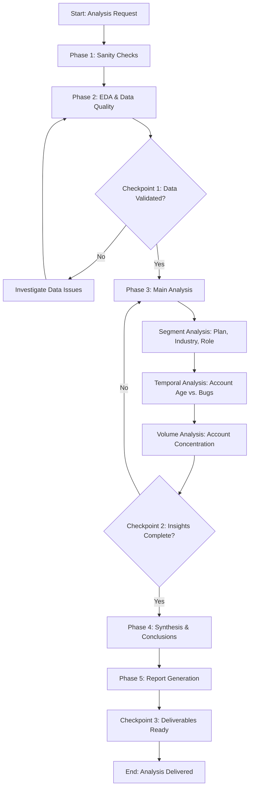

# Analysis Flow: Bug Ticket User Analysis

## Step-by-Step Flow

1. **Setup**: Create folder structure and documentation.
2. **Phase 1: Sanity Checks**: Validate counts and basic distributions for `support_tickets`, `accounts`, and `users`.
3. **Phase 2: EDA**:
    - Analyze distribution of ticket categories.
    - Check for missing values in `opened_by` and `org_id`.
    - Profile bug reporting volume over time.
4. **Phase 3: Main Analysis**:
    - **Query 01**: Breakdown of bug tickets by Account Plan Tier.
    - **Query 02**: Breakdown of bug tickets by Industry.
    - **Query 03**: Correlation between Account Age and Bug Reporting.
    - **Query 04**: Breakdown of bug tickets by User Role.
    - **Query 05**: Identification of "Power Bug Reporters" (top accounts).
5. **Phase 4: Synthesis**: Summarize findings in `conclusions.md`.
6. **Phase 5: Deliverables**: Generate branded HTML and PDF reports.

