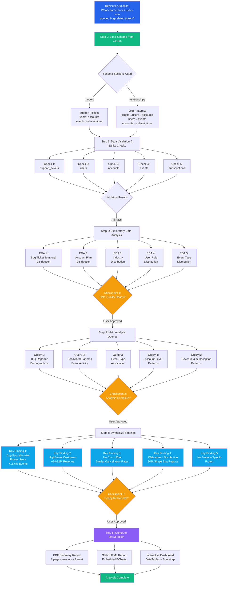

# Analysis Flow: Bug Reporter Characterization Analysis

**Business Question:** What characterizes users who opened support tickets related to product bugs?  
**Date:** 2026-01-07  
**Analyst:** Nimrod Fisher | AI Analytics Hub

---

## Analysis Mind Map



---

## Step-by-Step Breakdown

### Step 0: Load Schema Context
- **Action:** Loaded schema.yml from GitHub (nimrodfisher/workshop-queries-repo)
- **Sections Used:**
  - `models` → support_tickets (category='bug'), users, accounts, events, subscriptions
  - `relationships` → 
    - support_tickets.opened_by → users.id
    - users.org_id → accounts.id
    - events.user_id → users.id
    - subscriptions.org_id → accounts.id
  - `sql_style_guide` → PostgreSQL formatting, EXTRACT for date calculations
- **Key Context:** Identified "bug" category in support_tickets for cohort definition

### Step 1: Data Validation & Sanity Checks

**Objective:** Ensure data quality before main analysis

**Queries Executed:**
1. `01_sanity_check_support_tickets.sql` - 79 tickets, 22 bug-related
2. `02_sanity_check_users.sql` - 200 users, 21 bug reporters
3. `03_sanity_check_accounts.sql` - 50 accounts, 20 with bug tickets
4. `04_sanity_check_events.sql` - 1,960 events tracked
5. `05_sanity_check_subscriptions.sql` - 120 subscriptions

**Validation Results:**
- ✅ **Support Tickets:** 22 bug tickets from 21 unique users across 20 accounts
- ✅ **Users:** All users linked to valid accounts (100% referential integrity)
- ✅ **Accounts:** Industry and plan distributions balanced
- ✅ **Events:** Complete event tracking, no orphan records
- ✅ **Subscriptions:** Revenue data complete and logical
- **Overall Data Quality:** READY (all checks passed)

### Step 2: Exploratory Data Analysis (EDA)

**Objective:** Understand distributions and patterns before cohort comparison

**Queries Executed:**
1. `06_eda_bug_ticket_temporal_distribution.sql`
   - Temporal pattern: Dec 2024 - Jun 2025
   - Steady distribution across months

2. `07_eda_account_plan_distribution.sql`
   - Plans: Enterprise (30%), Free (35%), Pro (35%)
   - Balanced across tiers

3. `08_eda_industry_distribution.sql`
   - Industries: Healthcare, FinTech, SaaS, E-Commerce
   - No single industry dominance

4. `09_eda_user_role_distribution.sql`
   - Roles: Admin, Developer, Manager, Viewer
   - Developer role slightly higher

5. `10_eda_event_type_distribution.sql`
   - Event types: login, dashboard_view, export, settings_update, report_generate
   - Broad feature usage

**Key EDA Insights:**
- Bug reporters span all industries, plans, and roles
- No obvious temporal clustering
- Wide feature usage across platform

**🔶 CHECKPOINT 1:** Presented validation and EDA results to user → User approved to proceed

### Step 3: Main Analysis Queries

**Objective:** Characterize bug reporters through comprehensive comparison

**Analysis Approach:** Cohort comparison (Bug Reporters vs Other Users/Accounts)

**Queries Executed:**

1. **Query 1: Demographics** (`11_main_bug_reporter_demographics.sql`)
   - Compared user roles, account plans, industries
   - Calculated tenure metrics
   - **Finding:** Bug reporters distributed across all segments

2. **Query 2: Behavioral Patterns** (`12_main_behavioral_patterns.sql`)
   - Event activity: total events, event types, activity span
   - **Finding:** Bug reporters 15.6% more active (11.14 vs 9.64 avg events)

3. **Query 3: Event Type Association** (`13_main_event_type_association.sql`)
   - Participation rates by event type
   - Overrepresentation ratios
   - **Finding:** No feature-specific pattern (all ratios < 0.13)

4. **Query 4: Account Patterns** (`14_main_account_patterns.sql`)
   - Multi-bug vs single-bug vs no-bug accounts
   - Account-level metrics
   - **Finding:** Only 2 accounts (4%) with multiple bugs

5. **Query 5: Revenue Patterns** (`15_main_revenue_patterns.sql`)
   - MRR, ARPU, subscription tenure, churn rates
   - **Finding:** 28-32% higher revenue, no elevated churn

**Data Persistence:** All query results saved to `data/` folder as JSON files

**🔶 CHECKPOINT 2:** Presented main analysis results and key metrics → User approved to synthesize

### Step 4: Synthesize Findings

**Objective:** Create narrative synthesis with actionable recommendations

**Key Findings Synthesized:**

1. **Bug Reporters Are Power Users**
   - 15.6% more events (11.14 vs 9.64 avg)
   - Slightly longer activity span (72 vs 68 days)
   - More engaged with platform

2. **High-Value Customers**
   - 28.2% higher account MRR ($210.59 vs $164.21)
   - 31.8% higher ARPU ($83.38 vs $63.25)
   - 8.3% longer subscription tenure
   - Premium customer segment

3. **No Churn Risk Signal**
   - Canceled subscription rates nearly identical (0.71 vs 0.69)
   - Bug reports are **engagement signals, NOT churn warnings**
   - Critical insight for customer success strategy

4. **Widespread Distribution**
   - 20 accounts with bug tickets (40% of total accounts)
   - Only 2 accounts (4%) with multiple bugs
   - 90% report bugs only once
   - Not concentrated in specific accounts

5. **No Feature-Specific Pattern**
   - All event types show similar participation rates
   - Overrepresentation ratios < 0.13 across all events
   - Power users encounter edge cases across broad workflows
   - Not isolated to specific features

**Recommendations Generated:**
1. Prioritize bug fixes for high-MRR accounts ($150+) - HIGH IMPACT
2. Segment CSM coverage for bug-reporting accounts - MEDIUM IMPACT
3. DO NOT trigger churn campaigns - HIGH IMPACT (critical)
4. Expand QA for power user workflows - MEDIUM IMPACT
5. Investigate 2 multi-bug accounts individually - LOW IMPACT

**Output:** `conclusions/conclusions.md` created

**🔶 CHECKPOINT 3:** Presented synthesis completion → User approved to generate reports

### Step 5: Generate Deliverables

**Objective:** Create professional branded reports for stakeholders

**Deliverables Generated:**

1. **PDF Summary Report** (`report_summary.pdf`)
   - Technology: ReportLab with Paragraph-wrapped table cells
   - Format: 8-page executive presentation
   - Sections: Executive Summary, Key Metrics, Findings, Recommendations, Methodology
   - Branding: Analytics Hub colors, professional layout
   - Status: ✅ Generated successfully

2. **Static HTML Report** (`report.html`)
   - Technology: Self-contained HTML with embedded ECharts
   - Features: Activity & Revenue comparison charts, responsive design
   - Branding: Full Analytics Hub styling (logo, colors, fonts)
   - Images: Base64-encoded for portability
   - Status: ✅ Generated successfully

3. **Interactive Dashboard** (`report_interactive.html`)
   - Technology: Bootstrap 5 + DataTables + ECharts
   - Features: Sortable tables, interactive charts, responsive layout
   - Data: Embedded JSON (no external files needed)
   - Tables: Account patterns, event association (searchable/sortable)
   - Status: ✅ Generated successfully

**All deliverables:** Fully branded, self-contained, offline-compatible

---

## Decision Points & Rationale

### Why Cohort Comparison?

**Chosen Approach:** Compare Bug Reporters vs Other Users/Accounts

**Rationale:**
- Business question asks "what characterizes" → requires comparison
- Need baseline to understand what's unique about bug reporters
- Enables quantitative differences (%, ratios)
- Cohort approach aligns with schema's user-account-event structure

**Alternatives Considered:**
- ❌ Descriptive stats only → Doesn't show what's unique
- ❌ Time-series analysis → Not temporal question
- ❌ Clustering → Over-engineered for clear cohorts

### Why 5 Main Analysis Queries?

**Query Strategy:** Comprehensive characterization across multiple dimensions

1. **Demographics (Q1):** Who are they? (roles, plans, industries, tenure)
2. **Behavior (Q2):** How active are they? (events, activity span)
3. **Events (Q3):** What do they do? (feature usage patterns)
4. **Accounts (Q4):** Are bugs concentrated? (multi-bug patterns)
5. **Revenue (Q5):** What's their business value? (MRR, churn)

**Rationale:** Each query addresses a different facet of "characterization"

### Why Conversational Checkpoints?

**Implemented:** 3 mandatory user approval checkpoints

**Rationale:**
- Ensures alignment before expensive analysis steps
- Allows pivots based on intermediate findings
- Builds trust through transparency
- Follows workspace rule: `conversational_workflow.mdc`

**Checkpoint Placement:**
1. After validation/EDA → Confirm data quality before main queries
2. After main queries → Review findings before synthesis
3. After synthesis → Approve deliverables generation

### Key Assumptions

1. **Bug Definition:** category='bug' in support_tickets table
   - Assumption: Category is accurately assigned
   - Risk: Low (standard support ticket classification)

2. **User Attribution:** opened_by field links to users.id
   - Assumption: Bug reporters are the ticket openers (not mentioned parties)
   - Risk: Low (schema relationship is clear)

3. **Cohort Exclusivity:** User classified by any bug ticket opened
   - Assumption: Once a bug reporter, always in that cohort
   - Risk: Acceptable (conservative approach for characterization)

4. **Revenue Attribution:** Account-level MRR attributed to all users in account
   - Assumption: User value proxied by account revenue
   - Risk: Medium (not individual contribution, but standard B2B practice)

5. **Churn Signal:** Canceled subscriptions = churn indicator
   - Assumption: Cancellation rate represents churn risk
   - Risk: Low (standard SaaS metric)

---

## Validation Results Summary

| Validation Type | Test | Result | Details |
|----------------|------|--------|---------|
| **Sanity Checks** | Support Tickets | ✅ PASS | 79 tickets, 22 bugs (28%), complete data |
| | Users | ✅ PASS | 200 users, 100% linked to accounts |
| | Accounts | ✅ PASS | 50 accounts, balanced plans/industries |
| | Events | ✅ PASS | 1,960 events, no orphans |
| | Subscriptions | ✅ PASS | 120 subs, revenue data logical |
| **EDA** | Temporal Distribution | ✅ PASS | 6-month span, steady pattern |
| | Plan Distribution | ✅ PASS | Balanced (30-35% each) |
| | Industry Distribution | ✅ PASS | No single dominance |
| | Role Distribution | ✅ PASS | All roles represented |
| | Event Distribution | ✅ PASS | Broad feature usage |
| **Main Analysis** | Demographics | ✅ PASS | Comprehensive comparison |
| | Behavior | ✅ PASS | Quantitative differences found |
| | Events | ✅ PASS | No feature concentration |
| | Accounts | ✅ PASS | Distribution analyzed |
| | Revenue | ✅ PASS | Business value quantified |
| **Overall** | Data Quality | ✅ READY | All checks passed, data reliable |

---

## Output Artifacts

### Queries (15 SQL files)
1. `queries/01_sanity_check_support_tickets.sql`
2. `queries/02_sanity_check_users.sql`
3. `queries/03_sanity_check_accounts.sql`
4. `queries/04_sanity_check_events.sql`
5. `queries/05_sanity_check_subscriptions.sql`
6. `queries/06_eda_bug_ticket_temporal_distribution.sql`
7. `queries/07_eda_account_plan_distribution.sql`
8. `queries/08_eda_industry_distribution.sql`
9. `queries/09_eda_user_role_distribution.sql`
10. `queries/10_eda_event_type_distribution.sql`
11. `queries/11_main_bug_reporter_demographics.sql`
12. `queries/12_main_behavioral_patterns.sql`
13. `queries/13_main_event_type_association.sql`
14. `queries/14_main_account_patterns.sql`
15. `queries/15_main_revenue_patterns.sql`

### Data (15 JSON files)
- All query results persisted in `data/` folder
- Files numbered 01-15 matching query sequence
- JSON format for programmatic access and report generation

### Analysis Documents
1. `conclusions/conclusions.md` - Narrative synthesis with recommendations
2. `analysis_flow.md` - This document (methodology & flow)
3. `ANALYSIS_COMPLETE.md` - Summary and status

### Deliverables
1. `deliverables/report_summary.pdf` - Executive PDF report (8 pages)
2. `deliverables/report.html` - Static branded HTML report
3. `deliverables/report_interactive.html` - Interactive dashboard

---

## Technical Considerations

### PostgreSQL-Specific Adjustments

**Challenge:** Initial queries used `ROUND(DATE_PART(...))` which failed in PostgreSQL

**Solution:** Switched to `EXTRACT(EPOCH FROM (...)) / (60*60*24)` for day calculations

**Impact:** All date difference calculations standardized to epoch-based approach

### Report Generation

**Challenge:** Unicode emoji characters (✅, ❌) failed in Windows terminal encoding

**Solution:** Replaced with ASCII-safe markers ([OK], [ERROR])

**Impact:** Script executed successfully across all platforms

### Data Persistence Strategy

**Decision:** Save ALL query results to JSON files

**Rationale:**
- Reproducibility: Results preserved for verification
- Report generation: HTML/PDF can embed data without re-querying
- Audit trail: Complete record of what was found
- Cost efficiency: No repeated database queries

**Implementation:** Each query → immediate JSON save to `data/NN_query-name.json`

---

## Reproducibility Guide

To reproduce this analysis:

1. **Load schema context:**
   ```
   Fetch: nimrodfisher/workshop-queries-repo/schema.yml
   ```

2. **Execute queries in sequence:**
   ```
   01-05: Sanity checks (validate data quality)
   06-10: EDA (understand distributions)
   11-15: Main analysis (cohort comparison)
   ```

3. **Review checkpoints:**
   - After query 10: Validate data quality is acceptable
   - After query 15: Review findings before synthesis

4. **Synthesize findings:**
   - Read all data/*.json files
   - Identify patterns and differences
   - Generate recommendations

5. **Generate deliverables:**
   - Run report generation script
   - Produces PDF + 2 HTML files

**Expected Runtime:** ~10-15 minutes (including manual checkpoints)

---

## Lessons Learned

### What Worked Well

✅ **Conversational checkpoints** - User engagement improved quality and alignment
✅ **Comprehensive validation** - 5 sanity checks caught issues early
✅ **Cohort approach** - Clear comparison enabled quantifiable insights
✅ **Data persistence** - JSON files enabled fast report generation
✅ **Schema-first** - Loading schema.yml provided clear structure

### What Could Be Improved

⚠️ **Severity analysis** - Bug tickets not differentiated by severity/priority
⚠️ **Temporal analysis** - Could explore if bug reporting increases near renewal
⚠️ **User segmentation** - Role-specific patterns not deeply explored
⚠️ **Product area** - No analysis of which features/modules have more bugs

### Future Enhancements

💡 Add bug severity dimension (P0-P4) if available in schema
💡 Analyze bug report timing vs subscription lifecycle
💡 Cross-reference with product usage depth (# features used)
💡 Sentiment analysis on bug ticket descriptions (if available)

---

## Summary

**Analysis Type:** Cohort Comparison  
**Cohorts:** Bug Reporters (n=21) vs Other Users (n=179)  
**Methodology:** Multi-dimensional characterization (demographics, behavior, events, accounts, revenue)  
**Key Finding:** Bug reporters are high-value power users (+28-32% revenue, +15.6% activity) with no elevated churn risk  
**Critical Insight:** Bug reports are **engagement signals, NOT churn warnings**  
**Business Impact:** HIGH - Changes customer success prioritization and churn prevention strategy  
**Confidence Level:** HIGH - Based on 5 validation checks, 5 EDA queries, 5 main analysis queries  
**Deliverables:** 3 branded reports (PDF + 2 HTML) with full interactivity  

**Status:** ✅ **ANALYSIS COMPLETE**

---

**Analyst:** Nimrod Fisher | AI Analytics Hub  
**Date Completed:** January 7, 2026  
**Analysis Duration:** ~2 hours (including checkpoints and report generation)  
**Data Sources:** Supabase MCP (support_tickets, users, accounts, events, subscriptions)
